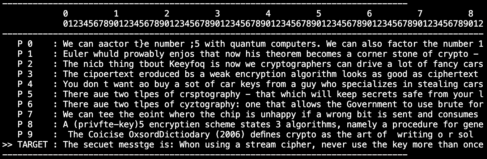
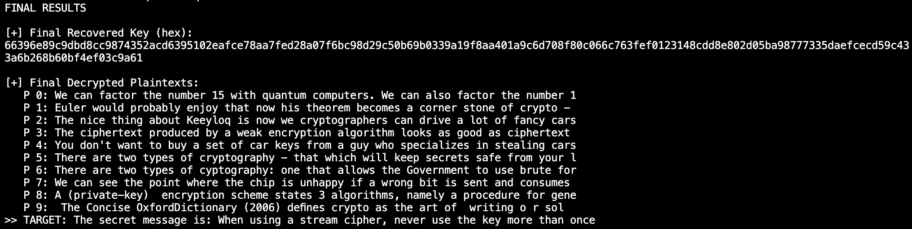

# Many-Time Pad Attack

## Approach

1. **Input**: Takes hex-encoded ciphertexts (`CIPHERTEXTS_HEX`) and a target index (`TARGET_CIPHERTEXT_INDEX`), converted to bytes.

2. **Automated Attack**:
   - For each target ciphertext position, collect bytes from applicable ciphertexts.
   - Test key bytes (0–255), XOR to get candidate plaintexts, and score using `score_text` (e.g., 'e': 9, space: 10, non-printables: -10).
   - Pick the highest-scoring key byte to decrypt the position.

3. **Interactive Refinement**:
   - Show plaintexts with an index.
   - Accept corrections (`msg_idx,char_pos,new_char`, e.g., `3,15,e`).
   - Update key and plaintexts until `quit`.

4. **Attack Logic**:
   - Score for readable plaintext.
   - Refine via user corrections.
   - Repeat until target plaintext is correct.

5. **Output**: Displays final key (hex) and plaintexts, highlighting the target.

## Demo
- **Before Correction**: Initial output with errors (e.g., "secuet messgte").
  
- **After Correction**: After `10,7,r`, `10,15,a`, `10,25,e`, fixed to "secret message".
  

## Usage
Run `python many_time_pad.py`

## Notes
Scoring assumes English text, needing manual corrections. XOR reveals plaintext relationships due to key reuse.